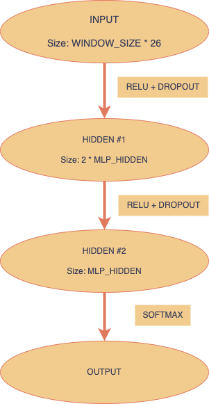

# Diacritics restoration

## Structure

- `data_utils.py` - utilities for data processing and fetching training data.
- `mlp.py` - model and train/test cycle definitions
- `training.py` - training the model, evaluating on the etest data
- `restore.py` - script for text restoration by user

## Approach

This tool is based on the MLP model, trained for diacritics prediction.

Firstly, target classifications are collected as existing (true)diacritics in the original text. Then, text is preprocessed with One Hot Encoding, applied on each character in its version without diacritics. For each character, which can possibly hold diacritic modification, we construct "faetures" as window of neighbouring characters. In this way, we omit characters which cannot be classified with diacritic (`b, f, g, h, etc.`) to save model capacity for better usage in learning phase.

In next step, MLP model is trained on the training set. MLP architecture:<br>


`where MLP_HIDDEN and WINDOW_SIZE are customizible parameters`

Respectivvely, in the evaluation phase, prediction are being made only for characters, which can possibly hold diacritic marks. This elevates model performance, because we omit possible wrong predictions.

Used technology - PyTorch.


## Training data
Corpus for training - fiction text dataset, taken from the NPFL129 course "Machine Learning for Greenhorns". Dataset contained ~90k tokens.

*NOTE:* ater training, `model.pt` file will be generated. It contains trained model's weights and can serve for further usage.

## Evaluation
Evaluation accuracy on `etest` dataset is 83-85%. Accuracy was colculated as a percentage of correct non-white characters in the output.

During validation, we measure model's accuracy percentage of correct classifications on the chracters, which can hold diacritic mark.

## How to run
- To setup project, train model and evaluate it, run:
```
make all
```

- To delete project dependencies and pycache, run:
```
make clean
```

- To restore diacritics for your "custom" text, you can use `restore.py` script. Just pass your text to its STDIN.
```
python restore.py
```